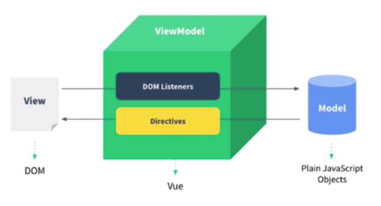
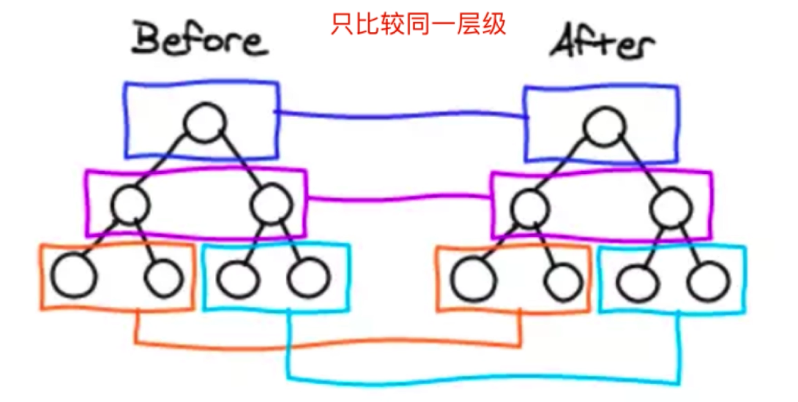
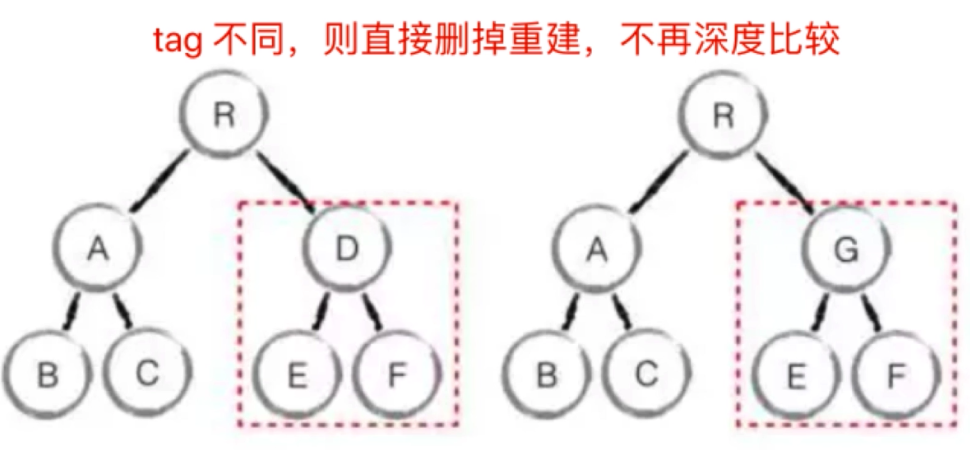
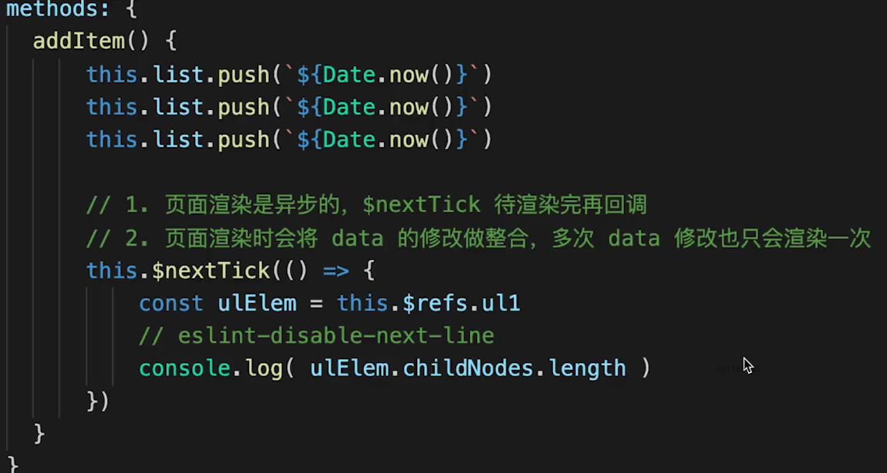

# Vue 原理
范围：
- 组件化
- 响应式
- vdom 和 diff
- 模板编译
- 渲染过程
- 前端路由

## 组件化基础
- “很久以前” 就有组件化
- 数据驱动视图（MVVM, setState）

### “很久以前”的组件化
- asp jsp php 已经有组件化了（include，require 等等方式载入视图或代码片段）
- nodejs 中也有类似的组件化

### 数据驱动视图
- 传统组件，只是静态渲染，更新还要依赖于操作 DOM
- 数据驱动视图 - Vue MVVM（vm是view mode的意思。所以mvvm框架是要有一个vm对象，来映射view。也就是vm对象的属性发生改变的时候，对应的视图部分会相对应更新。）
- 数据驱动视图 - React setState（没有纯粹意义上的vm对象，它有的是属性和状态。用属性和状态去映射视图。属性不可变，单向数据流）
> 什么是“数据驱动视图”，不自己操作DOM，修改只需要修改数据，框架根据数据重新渲染视图。这也是在前端基础的DOM操作中虽然我们要会，但是不常用的根本原因所在。数据驱动视图可以使Web应用具有更强大更复杂的功能，而不再让开发难度像操作DOM一样复杂困难。
> 注意 MVVM 代表的框架并不包含 React，参考：react是mvvm架构吗？ - 林志鹏的回答 - 知乎
https://www.zhihu.com/question/310674885/answer/585340871

### Vue MVVM

> Model 代表了 vue 的组件 data 或者是 vuex 数据。
MVVM:  
- M: Model
- V: View
- VM: ViewModel（负责视图和数据的连接和处理）

## [Vue 响应式](https://cn.vuejs.org/v2/guide/reactivity.html)
- **组件 data 的数据一旦变化，立刻触发视图的更新**
- 实现**数据驱动视图**(vue 和 react 的特点)的第一步
- 考察 Vue 原理的第一题（一般开始深入原理时初步范围会考察）  
**和平时开发密切相关的原理**  
- **核心 API - Object.defineProperty**
- 如何实现响应式
- Object.defineProperty 的一些缺点（Vue3.0 启用 [Proxy](https://developer.mozilla.org/zh-CN/docs/Web/JavaScript/Reference/Global_Objects/Proxy) - 兼容性不太好，且无法 [polyfill](https://developer.mozilla.org/zh-CN/docs/Glossary/Polyfill) - 一个兼容性的概念）  
Object.defineProperty 基本用法：  
```javascript
const data = {}
const name = 'zhangsan'
Object.defineProperty(data, "name", {
  get: function () {
    console.log('get')
    return name
  },
  set: function (newVal) {
    console.log('set') 
    name = newVal
  }
})

console.log(data.name)
data.name = 'lisi'
console.log(data.name)
```
output:  

> 将赋值(set)和获取(get)变成一个函数，这样便于做监听

### Objcet.defineProperty 实现响应式
- 监听对象，监听数组
- 复杂对象，深度监听
- 几个缺点  

手动实现监听：[observer](../../../demos/observer)  

#### 缺点
- 深度监听，需要递归到底，一次性（对象层级过深 - 递归性能消耗非常大甚至卡死）计算量大 (vue3.0 对深度监听进行了优化)
- 无法监听新增/删除属性（Vue.set / Vue.delete）
- 无法原生监听数组，需要[特殊处理](https://github.com/YonDee/FE-advanced/commit/9d77af68a04f4870ff4af3660665e5886149b748)（修改原型方法的触发方式，但是注意不要污染原型）

## 虚拟 DOM （Virtual DOM） 和 diff
- vdom 是实现 vue 和 React 的重要基石
- diff 算法是 vdom 中最核心、最关键的部分
- vdom 是一个热门话题，也是面试中的热门问题

- DOM 操作非常消耗性能
- 以前用 jQuery，可以自行空值 DOM 操作的时机，手动调整（以 JQ 和 JS 操作 DOM 为点来进行优化）
- Vue 和 React 是数据驱动视图， 如何有效控制 DOM 操作？

### 解决方案 - vdom
面临的问题
- 有了一定复杂度，想减少计算次数比较难
- 把计算转为JS计算，因为JS计算执行速度更快
- **vdom - 用 JS 模拟 DOM 结构，计算出最小的变更，操作 DOM**(vdom 的意义以及概念)  
  
DOM：
```html
<div id="div1" class="container">
  <p>vdom</p>
  <ul style="font-size: 20px">
    <li>a</li>
  </ul>
</div>
```
Virtual DOM:
```javascript
{
  tag: 'div',
  props: {
    className: 'container',
    id: 'div1'
  },
  children: [
    {
      tag: 'p',
      children: 'vdom'
    },
    {
      tag: 'ul',
      props: { style: 'font-size: 20px' },
      children: [
        {
          tag: 'li',
          children: 'a'
        }
        // ...
      ]
    }
  ]
}
```
> 用 JS 对象方式来描述一个 DOM
> 所以面试时会遇到诸如：请用 vnode 去模拟 html 片段

### [snabbdom](https://github.com/snabbdom/snabbdom)
- 简洁强大的 vdom 库，易学易用
- Vue 参考它实现的 vdom 和 diff
- Vue 3.0 重写了 vdom 的代码，优化了性能
- 但 vdom 的基本理念不变，面试考点也不变
- React vdom 具体实现和 Vue 也不同，但不妨碍统一学习  

#### snabbdom 的重点总结
- h 函数
- vnode 数据结构
- patch 函数

> 实际用例中可以看到 vdom 只会更新改变的部分，不会连带整个元素一起重新渲染，从而在渲染性能上也更加优秀

### vdom 总结
- 用 JS 模拟 DOM 结构（vnode）
- 新旧 vnode 对比，得出最小的更新范围，最后更新 DOM
- 数据驱动视图的模式下，有效控制 DOM 操作
> vdom 本身是一个概念集合，vnode 是个具体的实现方式

### diff 算法
- diff 算法是 vdom 中的核心，最关键的部分
- diff 算法能在日常使用 vue react 中体验出来（如：key）

#### diff 算法描述
- diff 即对比，是一个广泛的概念，如 linux diff 命令，git diff 等
- 两个 js 对象也可以做 diff，如 [jiff](https://github.com/cujojs/jiff)
- 两棵树对比差异会用到 diff，比如这里的 vdom diff

#### 树 diff 的时间复杂度 O(n^3)
- 第一，遍历 tree1; 第二，遍历 tree2
- 第三，排序
- 1000 个节点，要计算 1 亿此，算法不可用

#### 解决上面的问题，优化事件复杂度到 O(n)
- 只比较同一层级，不跨级比较
- tag 不相同，则直接删掉重建，不再深度比较
- tag 和 key，两者都相同，则认为是相同节点，不再深度比较  
  
  
不使用 key 和 使用 key 的对比：  

> 不使用 key 意味着有变化将会直接删除并进行重新插入的处理，而使用了之后根据 key 在两个 children （oldChildren & children - new）之间找到相同的就无需删除重建，可以直接移动元素位置

#### diff 算法总结
- patchVnode
- addVnodes removeVnodes
- updateChildren (key 的重要性)
> 上面的关键函数参考 [snabbdom](https://github.com/snabbdom/snabbdom) 进行查看，这里还有个算法原理的[总结](https://coding.imooc.com/learn/questiondetail/181966.html)

#### vdom 和 diff 总结
- vdom 核心概念很重要：h、vnode、patch、diff、key 等
- vdom 存在的价值更加重要：**数据驱动视图，控制 DOM 操作**

## 模板编译
- 模板是 vue 开发中最常用的部分，即与使用相关联的原理
- 模板不是 html，有指令、插值、JS 表达式；能实现判断、循环（一个可以实现顺序执行，判断，循环的计算机语言是具有图灵完备性的）
- 一般会通过“组件渲染和更新过程”来考察
> **模板在 vue 开发中会感觉类似于写 html，但并不是 html，模板最终会被转换成 JS 代码，而这个过程就叫做编译模板**
### 重点内容
- JS 的 [with](https://developer.mozilla.org/zh-CN/docs/Web/JavaScript/Reference/Statements/with) 语法（只是因为vue在模板编译时使用到了with，但是在一般开发中不建议使用with，会引起混淆错误和兼容性问题）
- [vue template complier](https://github.com/vuejs/vue-docs-zh-cn/tree/master/vue-template-compiler) 将模板编译为 render 函数
- 执行 render 函数生成 vnode（vnode 实现响应式和diff）  
### 概念
- 模板编译为 render 函数，执行 render 函数返回 vnode
- 基于 vnode 再执行 patch 和 diff
- 使用 webpack vue-loader，会在开发环境下编译模板

> 大多数情况下我们不需要使用 vue-template-complier ，通常使用 vue-loader 便可以完成一般开发
#### with
```javascript
const obj = {a: 100,b: 200}
console.log(obj.a)
console.log(obj.b)
console.log(obj.c) // undefined

// 使用 with，能改变 {} 内自由变量的查找方式
// 将 {} 内自由变量，当作 obj 的属性来查找
// 打破了作用域规则，易读性变差
with(obj) {
  console.log(a)
  console.log(b)
  console.log(c) // 报错
}
```

### vue 组件中使用 render 代替 template
这里和 React 不使用它的 JSX 是一个道理（但 JSX
 不是模板语言），不用模板去描述一系列 html 来进行 render
```javascript
Vue.component('heading', {
  // template: ``,
  render: function (createElement) {
    'h' + this.level,
    [
      createElement('a', {
        attrs: {
          name: 'headerId',
          href: '#' + 'headerId'
        }
      }, 'this is a tag')
    ]
  }
})
```
> 上面这种方式不直观，可读性差，易出错，但是在一些无法用 template 满足的情况下，还是会用到 render，这里可以说 React 本身一直用 render，JSX 不能算严格意义上的模板（官方称之为标签语法，是 JavaScript 的语法扩展）

## 组件 渲染/更新 过程
知识点：
- 响应式：监听 data 属性 getter setter （包括数组，数组的监听需要特别处理，参考上面的内容）
- 模板编译：模板到 render 函数，再到 vnode
- vdom: patch(elem, vnode) 创建 和 patch(vnode, newVnode) 更新  
过程：
- 初次渲染过程
- 更新过程
- 异步渲染

### 初次渲染过程
1. 解析模板为 render 函数（或在开发环境下已完成，例如已经build，vue-loader），注意这里不会执行 render
2. 触发响应式，监听 data 属性 getter setter
3. 执行 render 函数，生成 vnode，patch(elem, vnode)
```html
#### 执行 render 函数会触发 getter
<p>{{ message }}</p>

<script>
export default{
  data() {
    message: 'hello', // 会触发 get
    city: '背景'  // 不会触发 get，因为模板没用到，即和视图没关系
  }
}
</script>
```
如上这段代码，再渲染的时候会先解析data，因为模板中使用了data中的message，所以执行了 data getter，之后再执行render。

### 更新过程
1. 修改 data，触发 setter（此前在 getter 中已被监听）
2. 重新执行 render 函数，生成 newVnode
3. patch(vnode, newVnode)（patch 中的 diff 算法会计算最小代价来进行差异更新）

### 渲染和更新的过程流程图
重要  


## 异步渲染
优化相关的内容
- 相关 $nextTick
- 汇总 data 的修改，一次性更新视图
- 减少 DOM 操作次数，提高性能  


## 前端路由原理
- 复杂点的 SPA，都需要路由
- vue-router
- 和日常使用相关的原理  
知识点：
- vue-router 的路由模式
- hash
- history

### 网页 url 组成部分


### hash 路由
- hash 变化会触发网页跳转，即浏览器的前进、后退
- hash 变化不会刷新页面，SPA 必须的特点
- hash 永远不会提交到 server 端（与服务端不进行交互）
#### 实现一个 hash 路由
重点事件：[window.onhashchange](https://developer.mozilla.org/zh-CN/docs/Web/API/Window/onhashchange)  
[hash_router](../../../demos/vue/router/hash.html)

### H5 history
- 用 url 规范的额路由（没有'#'，路由形式和一般路由一样），但跳转时不刷新页面
- [history.pushState](https://developer.mozilla.org/en-US/docs/Web/API/History/pushState)
- [window.onpopstate](https://developer.mozilla.org/zh-CN/docs/Web/API/Window/onpopstate)

> 因为仅在访问第一次的时候刷新页面，所以需要后端做[配置](https://router.vuejs.org/zh/guide/essentials/history-mode.html#%E5%90%8E%E7%AB%AF%E9%85%8D%E7%BD%AE%E4%BE%8B%E5%AD%90)

#### 对比
一般路由跳转每次都会刷新页面，而h5 history模式会：
- https://github.com/xxx - 刷新页面
- https://github.com/xxx/yyy - 前端跳转，不刷新页面
- https://github.com/xxx/yyy/zzz - 前端跳转，不刷新页面

### 总结
- hash - window.onhashchange
- H5 history - history.pushState 和 window.onpopstate
- H5 history 需要后端支持
